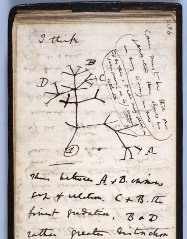

# Introduction

Charles Darwin theories about evolution revolutionized the field of biology and evolutionary biology, nevertheless when it comes to social sciences Darwin is mostly mentioned in relation to Social Darwinism, a set of theories that emerged in the Western world around 1870, that misapply the biological evolutionary language of Charles Darwin to politics, economy, and society.

In his most famous book, *On the origin of Species* from 1859, Darwin focuses on the struggle for existence, between and within species, and identifies natural selection and competition as the survival of the fittest. However, contrary to common belief, in that book he is not talking about human beings because Darwin cites a specific and diverse number of species, from plans to animals, to exemplify his ideas.

This follows an unavoidable logic and is that his ideas showed that the human being is not a subject of any teleology, because he is not the culmination of evolution, he is simply an animal among the rest of the living beings of the planet. And this affirmation, totally broke with the entrenched ideas defended at the time, linked to the exceptionality of the human being among the rest of species. Therefore, it was not until 1871 that Darwin published *The Descent of Man*, where he theorized and expounded ideas mentioning the human being specifically, altogether with other animals.

The *Descent of Man*, is an often-overlooked book, where Darwin does focus on mankind. In fact, in the first two chapters he argues that human beings come from some lower form of life, something that he did not mention at all in his previous and most cited book. Besides, in this book he defends that cooperation often replaces competition in the face of natural selection, in multiple species, among which is the human being. And this last idea totally break with the main assumptions done by Social Darwinism.

Hence, my aim is to build a corpus with both book titles and apply text maning techniques in order to explore some hypothesis.

# Hyphotesis

First, as Darwin revolutionary idea in the field of biology and evolutionary biology was that evolution take place at the species level, my hypothesis is 
that the term species is going to be mentioned a lot of times, but the term evolution not at all, because as far as i know in the mid-19th century, when Darwin was writing, the word "evolution" had different connotations  than it 
does today, because at that time, the term was often associated with the idea of a linear, progressive development of life forms, whereas Darwin's theory 
proposed a more complex, branching pattern of descent, as his famous *Tree of Life* sketched in his notes shows

<div style="text-align:center">
  

  Reference: https://museoecologiahumana.org/piezas/el-cuaderno-b-de-darwin-y-el-coral-de-la-vida/
</div>

Secondly, as the subtitle of *The descent of man, and selection in relation to sex* shows, my hypothesis is that in this book Charles Darwin focuses more on "sexual selection" and that *On the origin of species* he focuses more on "natural selection", therefore reading both books is needed to understand Darwin theory of evolution influence in actual evolution theories, because distinctive deaths (natural selection) and distinctive births (sexual selection) are the engines of evolution. 

Moreover, as was explained in the introduction, in his first and most famous book *On the origin of species*, Darwin does not mention humans, due to the teleological ideas surrounding humans at the time, but in the second one, *The descent of man*, he does mention humans. Hence, another hypothesis is that *On the origin of species* is a book about animal and plants biology in general, while *The descent of man* is going to be more focused on human biology.

In forth place, competition among and with-in species and mutual aid with-in species are two factors of evolution in any species, but my hypothesis is that *On the origin of species* competition is going to be more present than aid because this book focuses on the struggle for life and on natural selection, while *The descent of man* defends that cooperation is an important factor of evolution among human beings and other animals, therefore the word aid is going to be more used than the word competition, which will highlight the fact that Social Darwinism is based on a biased reading of Darwin and on a misinterpretation of his theories.

# Libraries

```{r message=FALSE, warning=FALSE}
library(tidyverse)
library(ggplot2)
library(dplyr)
library(gutenbergr) 
library(tidytext)
library(tidyr)
library(scales)
library(forcats)
```

# Downloading the books and recoding variables

  *On the Origin of Species* (1859): ID 2009

  *The Descent of Man* (1871): ID 2300

```{r warning=FALSE}
darwin <- gutenberg_download(c(2009, 2300)) %>% 
  rename(title = gutenberg_id) %>%
  mutate(title = case_when(title== 2009 ~ "speciesorigin",
                           title== 2300 ~ "descentman"))

speciesorigin <- gutenberg_download(2009)%>% 
  rename(title = gutenberg_id) %>%
  mutate(title = case_when(title== 2009 ~ "speciesorigin"))

descentman <- gutenberg_download(2300) %>% 
  rename(title = gutenberg_id) %>%
  mutate(title = case_when(title== 2300 ~ "descentman"))
```

# Tokenizing and filtering stopwords

First of all, I am going to tokenize the books, breaking their text in words in 
order to know which are the most mentioned words in both Darwin titles, and to 
do so, first I need to remove extremely common grammar words like "the" or "for" using stopwords function, because those words are not useful to see the similarities and differences between both titles.


```{r}
#BOTH TITLES
clean_darwin <- darwin %>%
  unnest_tokens(word, text)%>%
  anti_join(stop_words, by= "word")

#ORIGIN OF SPECIES
clean_speciesorigin  <- speciesorigin  %>%
  unnest_tokens(word, text)%>%
  anti_join(stop_words, by= "word")

#DESCENT OF MAN
clean_descentman  <- descentman  %>%
  unnest_tokens(word, text)%>%
  anti_join(stop_words, by= "word")

```

# Words count and proportion

## Ten most repeated words

These visualizations show the ten most repeated words taking into account both titles as one, and the ten most repeated words in each of the titles.

```{r}
#BOTH TITLES
clean_darwin  %>%
  count(word, sort = TRUE) %>%# I have used this line of code on its own, to see how many times the 10th most repeated word was used, to filter by that number below
  filter(n >= 843) %>%#only words mentioned 893 times or more, which includes the 10 most used words
  #reorder words by number of mentions
  mutate(word = reorder(word, n)) %>%
  #A barplot with the 10 most repeated word and the number of times they are mentioned
  ggplot(aes(n, word)) +
  geom_col(fill= "tan") +
  labs(y = NULL, x=NULL)+
  ggtitle("10 most used words in both Darwin books")

#DESCENT OF MAN
clean_descentman  %>%
  count(word, sort = TRUE) %>%# I have used this line of code on its own, to see how many times the 10th most repeated word was used, to filter by that number below
  filter(n >= 621) %>%#only words mentioned 621 times or more, which includes the 10 most used words
  #reorder words by number of mentions
  mutate(word = reorder(word, n)) %>%
  #A barplot with the 10 most repeated word and the number of times they are mentioned
  ggplot(aes(n, word)) +
  geom_col(fill= "salmon") +
  labs(y = NULL, x=NULL)+
  ggtitle("10 most used words in \"The descent of men\"")

#ORIGIN OF SPECIES
clean_speciesorigin  %>%
  count(word, sort = TRUE) %>%# I have used this line of code on its own, to see how many times the 10th most repeated word was used, to filter by that number below
  
  filter(n >= 325) %>%#only words mentioned 325 times or more, which includes the 10 most used words
  #reorder words by number of mentions
  mutate(word = reorder(word, n)) %>%
  #A barplot with the 10 most repeated word and the number of times they are mentioned
  ggplot(aes(n, word)) +
  geom_col(fill= "turquoise") +
  labs(y = NULL, x=NULL)+
  ggtitle("10 most used words in \"On the origin of species\"")

```

Taking into account both books the most repeated word is "species", which shows 
us the importance this concept has on Charles Darwin books due to the fact that Darwin revolutionary idea was that evolution takes places and its observable at 
the species level. Also "selection" and "natural" are among the ten most repeated words, therefore, they might form a common bigram. Moreover, I found really curios that "birds" is among them, probably due to the fact that the theory of evolution was shaped by Charles Darwin trough observation of the thirteen different Galápagos finches species, because all of them live in the same island but have different peaks according to its differential diet, which shows how 
environmental pressure and diet restrictions are factors of natural selection.

Focusing *On the origin of species*, the most repeated word, almost 2000 times, 
is "species" while the other most used nine words are present just around 500 times. "Natural" and "selection" are also among the most repeated words in this book. And the rest of the words like "animals", "plants", "varieties", "naturae"... show that my hypothesis about this book talking about biology in general, and not specifically about humankind, might be true.

Besides, in *The descent of man* the word "species" is also among the ten most used words, in forth position, being used more than 1000 times, and in this case "natural" is not among the most used words, but "sexual" and "selection" are, as the subtitle of this book indicated. Furthermore, "male", "males" and "female" are the three most used words, and "females" is in sixth position, hence, my hypothesis about this book talking specifically about sexual selection might be true because the basis of sexual selection is that a female and a male are needed.

## Words of specific interest: competition & aid

```{r}
clean_darwin  %>%
  filter(word  == "competition")%>%
  group_by(title) %>% summarise(n=n())%>%
  ggplot(aes(title, n)) +
  geom_col(fill= "tan") +
  ggtitle("\"Competition\" word in both titles")+
  labs(y = NULL, x= NULL)


clean_darwin  %>%
  filter(word  == "aid")%>%
  group_by(title) %>% summarise(n=n())%>%
  ggplot(aes(title, n)) +
  geom_col(fill= "darkolivegreen") +
  ggtitle("\"Aid\" word in both titles")+
  labs(y = NULL, x=NULL)
```

This graph shows that my hypothesis about "competition" and "aid" is true, both words are present is both titles because both dynamics are an important part 
of evolution, and shape species, but competition is used 50 times *On the origin of species* while just 10 times in *The descent of man*, but when it comes to 
"aid" it was used more than 80 times in *The descent of man* and around 30 times *On the origin of species*. Hence, Social Darwinism ideas seem to be based on a biased reading of Charles Darwin, because competition is important when it comes to evolution, but mutual aid is also an importan factor of evolution.

## Words of specific interest: evolution, finches & birds

```{r}
clean_darwin  %>%
  filter(word  == "evolution")%>%
  group_by(title) %>% summarise(n=n())%>%
  ggplot(aes(title, n)) +
  geom_col(fill= "tan") +
  ggtitle("\"Evolution\" word in both titles")+
  labs(y = NULL, x=NULL)

clean_darwin  %>%
  filter(word  == "finches")%>%
  group_by(title) %>% summarise(n=n())%>%
  ggplot(aes(title, n)) +
  geom_col(fill= "salmon") +
  ggtitle("\"Finches\" word in both titles")+
  labs(y = NULL, x=NULL)

clean_darwin  %>%
  filter(word  == "birds")%>%
  group_by(title) %>% summarise(n=n())%>%
  ggplot(aes(title, n)) +
  geom_col(fill= "turquoise") +
  ggtitle("\"Birds\" word in both titles")+
  labs(y = NULL, x=NULL)

```

The brown graph shows that "evolution" is mostly used in *The descent of man* but just 30 times, and even when taking into account both titles it is not used more than 50 times, therefore this concept was not used often at all, and this suggest, that my hypothesis about how that word was used in Darwin times seems to be true. 

The salmon graph shows that "finches" is hardly ever mentioned while the blue graph shows that birds is a word mentioned plenty of times, therefore the hypothesis that emerged when I saw that birds was one of the most used words is not true. This is due to the fact that in *The descent of man* the word bird was used more than 750 times, while finches was not even used ten times.

 
## Word frequency

As I have two books of different length, word counts are not directly comparable, therefore I am going to use word frequencies because that measure shows the most common words taking into account each book length.

```{r}
frequency <- bind_rows(mutate(clean_speciesorigin, 
                              title = "Origin_of_species"),
                       mutate(clean_descentman, 
                              title = "Descent_of_man")) %>% 
  #regex to identify words and not _words_
  mutate(word = str_extract(word, "[a-z']+")) %>%
  drop_na(word)%>%
  count(title, word) %>%
  #calculate proportion
  group_by(title) %>%
  mutate(proportion = n / sum(n)) %>% 
  select(-n) %>% 
  #reshape dataframe
  pivot_wider(names_from = title, values_from = proportion) %>%
   pivot_longer(`Origin_of_species`:`Descent_of_man`,
              names_to = "title", values_to = "proportion") %>%
  group_by(title)%>%
arrange(desc( proportion))

frequency

```

As the table above shows, using frequency of words and using word counts, gives 
pretty similar results when it comes to know which are the most used words, even
though *On the origin of species* has 10000 words more than *The descent of man*.

## Visualizing words of interest frequency in both books 

Comparing the proportion of times a word appears in each book title, to see in
which title it is most frequent.

```{r message=FALSE, warning=FALSE}

frequency_species <- frequency%>% filter(word=="species")%>% arrange(desc(word))

  ggplot(frequency_species)+
    aes(title, proportion) +
  geom_col(fill= "tan") +
    ggtitle("Frequency of \"species\" word in both  titles")
  labs(y = NULL, x= NULL)

frequency_humans <- frequency%>% filter(word %in% c("male", "female", "males", "females"))%>% arrange(desc(word))

 ggplot(frequency_humans)+
    aes(title, proportion) +
  geom_col(fill= "darkolivegreen") +
    ggtitle("Frequency of \"male\", \"males\",\"female\",\"females\" words in both  titles")
  labs(y = NULL, x= NULL)
  
  frequency_competition <- frequency%>% filter(word == "competition")%>% arrange(desc(word))

 ggplot(frequency_competition)+
    aes(title, proportion) +
  geom_col(fill= "tan2") +
    ggtitle("Frequency of \"competiton\" words in both  titles")
  labs(y = NULL, x= NULL)
  
   frequency_aid <- frequency%>% filter(word == "aid")%>% arrange(desc(word))

 ggplot(frequency_aid)+
    aes(title, proportion) +
  geom_col(fill= "darkolivegreen3") +
    ggtitle("Frequency of \"aid\" words in both  titles")
  labs(y = NULL, x= NULL)

```

As mentioned above using frequency of words and using word counts, gives 
pretty similar results when it comes to know which are the most used words in both titles. 

# Term frequency and distinctive words

While word frequency refers to how many times the word appears on the corpus, term frequency refers to how frequently a wod appears, however, both take into account how often or frequently the word is present relative to the total number of terms in the corpus.

Nevertheless, term frequency is a metric needed to compute TF-IDF, which is a 
measure that takes into account both, the frequency of a term in a particular 
title and its frequency across the entire corpus, which will allow to identify 
distinctive words in both titles.

## 1. How many times each word appears in each book

```{r}

both_darwin_words <- darwin %>%
  unnest_tokens(word, text) %>%

  count(title, word, sort = TRUE)

both_darwin_words
```

## 2. How many total words there are in each book

```{r}
each_darwin_words <- both_darwin_words %>% 
  group_by(title) %>% 
  summarize(total = sum(n))

each_darwin_words
```

## 3. Adding the total to "both_darwin_words" dataframe

```{r}
both_darwin_words <- left_join(both_darwin_words, each_darwin_words)
both_darwin_words
```

## 4. Calculate term frequency

The number of times a word appears in a book divided by the total number of 
words in that book

```{r}
both_darwin_words <- both_darwin_words %>%
#term frequency for each title
  mutate(term_frequency = n/total)

both_darwin_words
```


## 5. Get TF-IDF

The function output is tf, idf and a combination of both, tf-idf

```{r}
darwin_tf_idf <- both_darwin_words %>%
  bind_tf_idf(word, title, n)

darwin_tf_idf
```

These first words in the data frame have very low TF-IDF, near zero, because 
these are words that occur many times in both Darwin´s books.

## 6. Distinctive words 

The more times a word appears in both titles, the less distinctive it is of any 
of them, so the TF-IDF metric will be higher for words that occur fewer times.

To check this, we just have to arrange the dataframe by TF-IDF:

```{r}
darwin_tf_idf %>%
  select(-total) %>%
  arrange(desc(tf_idf))
```

## 7. Visualize distictiveness

```{r}
darwin_tf_idf %>%
  group_by(title) %>%
  slice_max(tf_idf, n = 10) %>% #maximun of ten words
  ungroup() %>%
  ggplot(aes(tf_idf, fct_reorder(word, tf_idf), fill = title)) +
  geom_col(show.legend = FALSE) +
  facet_wrap(~title, ncol = 2, scales = "free") +
  labs(x = "tf-idf", y = NULL)
```


### Filtering unconvenient words

There is no need to filter stopwords, because with TF-IDF metrics they are just 
not considered as important words in the text, because grammar words occur many times in both titles, so they have low TF-IDF, near zero.

However,in the graph above we can see there is commonly used abbreviations in 
book citations and bibliographies like vol= volume, fig= figure and p= page, and 
also numbers indicating years, which are words that provide no meaningful 
insight for my research, thus, I am going to remove them.

```{r}
darwin_stopwords <- tibble(word = c("vol", "fig", "p", "pp", "1868", "1869", "1870"))
```

Removing those specific words 

```{r}
both_darwin_words<- anti_join(both_darwin_words, darwin_stopwords, 
                           by = "word")

#To plot it
plot_darwin <- both_darwin_words %>%
  bind_tf_idf(word, title, n) %>%
  mutate(word = str_remove_all(word, "_"))
```

## 8. Visualizing distictiveness without unconvinient words

```{r}
plot_darwin %>% 
  group_by(title) %>% 
  slice_max(tf_idf, n = 10) %>% #maximun of ten words
  ungroup() %>%
  mutate(word = reorder(word, tf_idf)) %>%
  ggplot(aes(tf_idf, word, fill = title)) +
  geom_col(show.legend = FALSE) +
  labs(x = "tf-idf", y = NULL) +
  facet_wrap(~title, ncol = 2, scales = "free")
```

What TF-IDF measure shows here, is that Charles Darwin used different specific vocabulary related to different topics in both titles.

On one hand, distinctive words in *The descent of man* are related to birds 
sexual selection like "courtship", "transmission", "ornamented", "vocal" or
"coloration" which aligns with the discovery that "birds" is one of the most 
used words in that book. Moreover, the word "stridulation" is related to the 
sexual selection of insects, because stridulation is a method of sound 
production that involves rubbing body parts together to create friction, and 
crickets or grasshoppers males use stridulation to attract females for mating.
Furthermore, "pugnacity" is a term that refers to a tendency to fight or attack.
For example, some animals exhibit pugnacity during the mating season when they 
compete with other members of their species for mates. Hence, all this findings
show that in *The descent of man*, humankind sexual selection is explained 
altogether with insect, birds and other animals sexual selection, placing humans 
at the same level of other living things showing that the human being is not a 
subject of any teleology, because he is not the culmination of evolution, he is 
simply an animal among the rest of the living beings of the planet.

On the other hand, *On the origin of species*, there is many words related to 
paleontology, such as "strata", "sediment" "formation", "glaciar" or "cambrian",
because paleontology is focused on the study of extinct organism and their 
evolutionary history. On top of that, there is other terms related to biology 
like "larvae", "flora", or "naturalized", which is a term used to describe a 
plant or animal species that is not native to a particular area, but has been 
introduced to that area and now lives and reproduces there autonomously.

Therefore, as one of my main hypothesis affirmed, when can see that *The descent of man* is mostly focused on sexual selection, and *On the origin of species* is 
more focused in general biology and natural selection. 

# Bigrams: most common and distinctive ones

I have been working with words, but it is also important to work with n-grams 
where n=2. This is due to the fact that many words that characterized Darwin 
were bigrams like "natural selection", "sexual selection" or the name of species,
because since Carl Linnaeus wrote  *Systema Naturae* in 1758, species have a 
binomial nomenclature such as *Homo sapiens*

```{r}

darwin_bigrams <- darwin %>%
  unnest_tokens(bigram, text, token = "ngrams", n = 2) %>%
  filter(!is.na(bigram))


darwin_bigrams
```

The most frequent bigrams:

```{r}
darwin_bigrams %>%
  count(bigram, sort = TRUE)
```

To remove stopwords, first I am splitting bigrams in different columns

```{r}
bigrams_separated <- darwin_bigrams %>%
  #we separate each bigram in two columns, word1 and word2
  separate(bigram, c("word1", "word2"), sep = " ")

bigrams_separated
```

And secondly, filtering all stopwords included in the word column 

```{r}
bigrams_filtered <- bigrams_separated %>%
  filter(!word1 %in% stop_words$word) %>%
  filter(!word2 %in% stop_words$word)

bigrams_filtered
```

Now that I have removed stopwords, there is still a problem because numbers and 
the word edition are not informative about the books content, so I need to 
remove them as I did with the stopwords.

```{r}
bigrams_filtered <- bigrams_filtered %>%
  filter(!grepl("[0-9]+", word1)) %>%
  filter(!grepl("[0-9]+", word2)) %>%
  filter(!grepl("edition", word1)) %>%
  filter(!grepl("edition", word2)) %>%
  filter(!grepl("vol", word1)) %>%#vol ii was in third place in most used words, so i had to                                      remove it too
  filter(!grepl("ii", word2))
  

bigrams_filtered
```

```{r}

bigram_counts <- bigrams_filtered %>% 
  count(word1, word2, sort = TRUE)

bigram_counts
```

To get both words to be a single column again

```{r}
bigrams_united <- bigrams_filtered %>%
  unite(bigram, word1, word2, sep = " ")

bigrams_united

```


## Bigrams of specific interest

#### Species:
  
```{r}
  bigrams_filtered %>%
  filter(word2 == "species") %>%
  count(title, word1, word2, sort = TRUE)
```

It is one of the most used words in both titles and as we can see, it appears next to a varied number of adjectives, this shows the may uses and the importance that Darwin gave to this biological concept.

#### Selection, natural and sexual:
  
```{r}
bigrams_filtered %>%
  #main word in his work, goes always in second position
  filter(word2 == "selection") %>%
  count(title, word1, word2, sort = TRUE)

#And first can have "natural"
bigrams_filtered %>%
  filter(word1 == "natural") %>%
  filter(word2 == "selection") %>%
  count(title, word1, word2, sort = TRUE)

#Or can have "sexual"
bigrams_filtered %>%
  filter(word1 == "sexual") %>%
  filter(word2 == "selection") %>%
  count(title, word1, word2, sort = TRUE)
```

In the given context of Charles Darwin works, we can see that "natural selection" and "sexual selection" are collocations because is more likely that this words occur together than individually, because they are main concepts coined by 
Darwin that are still used in evolutionary theories.  

#### *Homo sapiens*:

```{r}
bigrams_filtered %>%
  filter(word1 == "Homo") %>%
  filter(word2 == "sapiens") %>%
  count(title, word1, word2, sort = TRUE)
```
The term does not appear even once, which surprised me because I thought it would not be present *On the origing of species* but it would be present in *The descent of man*. Therefore, I checked the word in Google Books Ngram viewer and realized that the term was not popularized in scientific literature till 1900´s, which may be an indicator of how long in has taken to break the teleology surrounding human beings, because till that date, humankind was not named with the binomial nomenclature for species, as the rest of the living beings in this planet.
  


#### Male, female, females and males:

```{r}
#male
  bigrams_filtered %>%
  filter(word1 == "male") %>%
  count(title, word1, word2, sort = TRUE)
  
    bigrams_filtered %>%
  filter(word2 == "male") %>%
  count(title, word1, word2, sort = TRUE)
 
#female   
     bigrams_filtered %>%
  filter(word1 == "female") %>%
  count(title, word1, word2, sort = TRUE)
    
      bigrams_filtered %>%
  filter(word2 == "female") %>%
  count(title, word1, word2, sort = TRUE)
   
#males   
       bigrams_filtered %>%
  filter(word1 == "males") %>%
  count(title, word1, word2, sort = TRUE)
       
        bigrams_filtered %>%
  filter(word2 == "males") %>%
  count(title, word1, word2, sort = TRUE)

#females       
        bigrams_filtered %>%
  filter(word1 == "females") %>%
  count(title, word1, word2, sort = TRUE)
        
        bigrams_filtered %>%
  filter(word2 == "female") %>%
  count(title, word1, word2, sort = TRUE)
```

There is many bigrams with those four words, but the interesting thing is that most of those bigrams are from *The descent of man* because it is a book that centers on sexual selection and sexual selection is needed a male and a female. Furthermore, the most repeated word altogether with these four is adult, because only among adults of any species, sexual selection takes place.

### Distinctive bigrams with TF-IDF

As in the words case, I am going to combine bigrams with TF-IDF analysis, to know
which are the most distinctive bigrams

```{r}
bigram_tf_idf <- bigrams_united %>%
  count(title, bigram) %>%
  bind_tf_idf(bigram, title, n) %>%
  arrange(desc(tf_idf))

bigram_tf_idf
```

Grouping by title, and visualizing most distinctive bigram in each book

```{r}
bigram_tf_idf %>%
  group_by(title) %>%
  slice_max(tf_idf, n = 10) %>% #maximun of ten words
  ungroup() %>%
  ggplot(aes(tf_idf, fct_reorder(bigram, tf_idf), fill = title)) +
  geom_col(show.legend = FALSE) +
  facet_wrap(~title, ncol = 2, scales = "free") +
  labs(x = "tf-idf", y = NULL)
```

Focusing on *The descent of man*, all distinctive bigrams, besides "numerical proportion" are refereed to sexual selection, but the only word that can be linked directly with *Homo sapiens* sexual selection is "social insticts", therefore despite the books focuses on sexual selection it does not seem this book talks specifically about humans.

Moreover, when it comes to *On the origin of species*, the distinctive bigrams are related to biology of animals and plants in general.


# Conclusion

My first hypothesis about the word "species" seems to be true because in both books is one of the most mentioned words, and as bigrams showed, it is used with a varied number of adjectives. On top of that,the word "evolution" is present in his works but it is not a remarkable word, therefore my findings agree with my first hypothesis 

My second hypothesis also seems to be true, because as distinctiveness analysis in words and bigrams have shown, altogether with word counts and word proportions, *On the origin of species* is more focused on natural selection and *The descent of man* focuses on sexual selection.

In third place, it seems not to be true that *The descent of man* focuses concretely on humans, because it talks about sexual selection in humans and animals. However, in is true that *On the origin of species* focuses on biology of plants and animals in general.

Moreover, is was true that competition and aid are words used in both books, because both concepts are factors of evolution, but as my forth hypothesis defended, and as word count and word proportion have shown, competition is more used *On the origin of species* and "aid" is more present in *The descent of man*. A fact that highlights that Social Darwinism is based on a biased reading of Darwin and on a misinterpretation of his theories.

Finally, other interesting findings have been realizing that *Homo sapiens* was
a concept not used at all by Charles Darwin, and also realizing the importance birds have in his theories and works. And it is not only that finches have a lot of relevance when in comes to Darwin´s first hypothesis about evolution, it is also related to the fact that birds and their sexual selection have a strong presence in his works.


